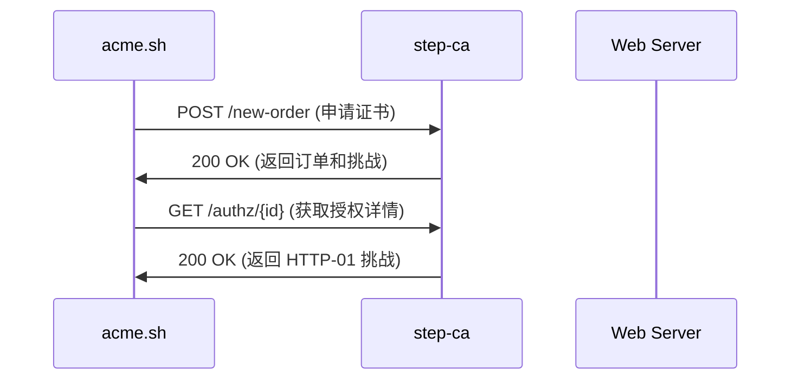
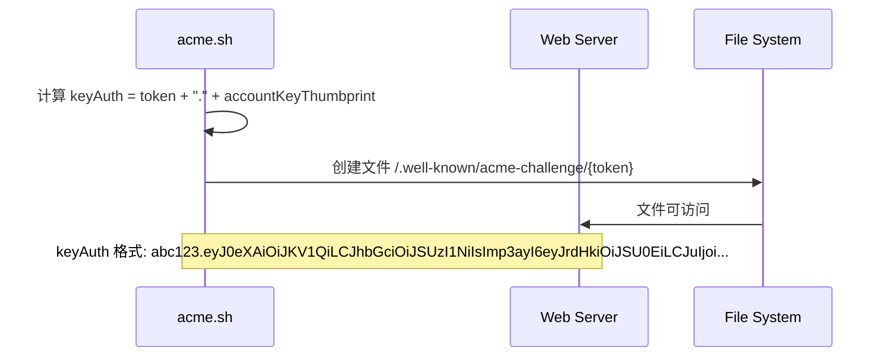
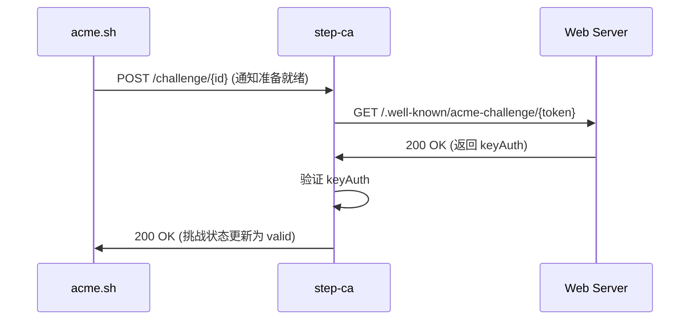
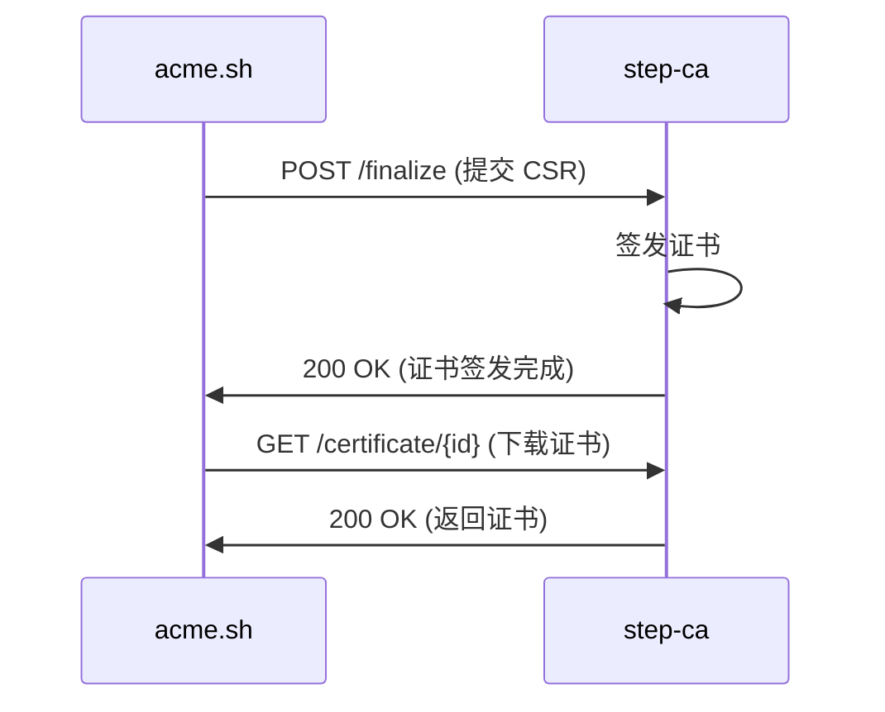
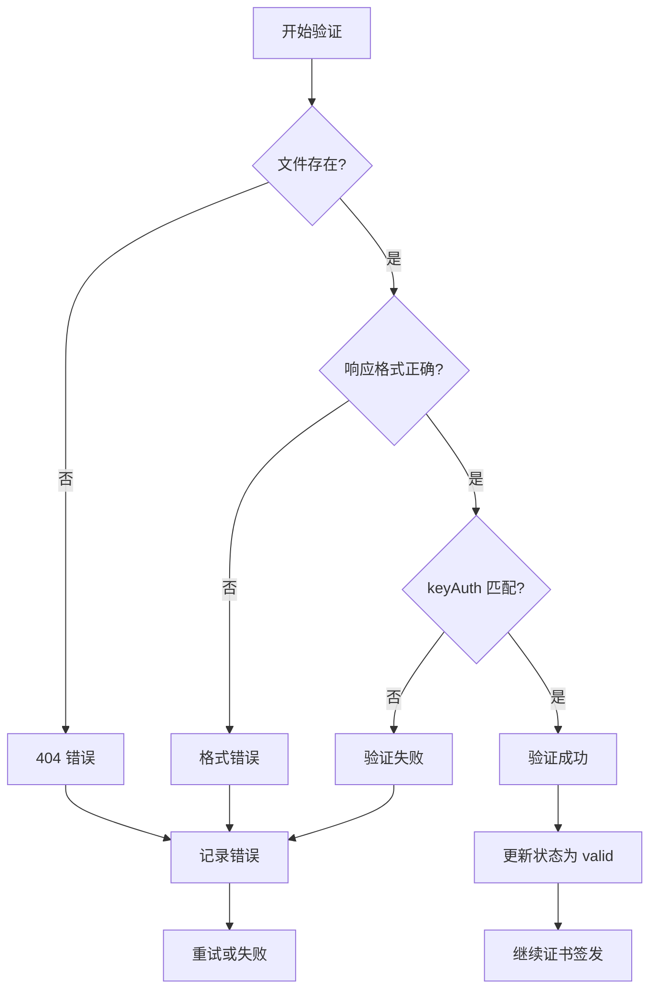

# ACME HTTP-01 挑战流程可视化

## 1. 证书申请阶段



**关键点：**
- acme.sh 发送 JWS 签名的请求
- step-ca 返回包含挑战的订单
- 挑战包含 `token` 和验证 URL

## 2. 挑战准备阶段



**关键点：**
- `keyAuth` 由 token 和账户密钥指纹组成
- 文件必须通过 HTTP 可访问
- 响应格式必须是纯文本

## 3. 挑战验证阶段



**关键点：**
- step-ca 主动发起验证请求
- 验证过程是自动的
- 验证成功后才继续证书签发

## 4. 证书签发阶段



## 详细的数据流

### 1. 挑战创建

```json
// step-ca 返回的挑战信息
{
  "type": "http-01",
  "url": "https://stepca:9000/acme/acme/challenge/abc123/def456",
  "status": "pending",
  "token": "abc123def456"
}
```

### 2. 挑战响应计算

```bash
# acme.sh 内部计算过程
accountKey = 读取账户私钥
accountKeyThumbprint = base64url(SHA256(accountKey))
keyAuth = "abc123def456" + "." + accountKeyThumbprint
```

### 3. 文件创建

```bash
# 文件路径
/tmp/webroot/.well-known/acme-challenge/abc123def456

# 文件内容
abc123def456.eyJ0eXAiOiJKV1QiLCJhbGciOiJSUzI1NiIsImp3ayI6eyJrdHkiOiJSU0EiLCJuIjoi...
```

### 4. HTTP 验证请求

```http
GET /.well-known/acme-challenge/abc123def456 HTTP/1.1
Host: example.com
User-Agent: step-ca/1.0

HTTP/1.1 200 OK
Content-Type: text/plain

abc123def456.eyJ0eXAiOiJKV1QiLCJhbGciOiJSUzI1NiIsImp3ayI6eyJrdHkiOiJSU0EiLCJuIjoi...
```

## 验证逻辑详解

### step-ca 验证步骤

```go
// step-ca 内部的验证逻辑（伪代码）
func validateHTTP01Challenge(token, response string) bool {
    // 1. 解析响应
    parts := strings.Split(response, ".")
    if len(parts) != 2 {
        return false
    }
    
    // 2. 验证 token
    if parts[0] != token {
        return false
    }
    
    // 3. 解码账户密钥指纹
    thumbprint, err := base64url.Decode(parts[1])
    if err != nil {
        return false
    }
    
    // 4. 验证账户密钥
    return validateAccountKey(thumbprint)
}
```

### 安全验证机制

1. **Token 验证**：确保响应对应正确的挑战
2. **密钥指纹验证**：确保响应来自正确的账户
3. **时间窗口**：挑战有有效期限制
4. **重试限制**：防止暴力破解

## 错误处理流程



## 调试技巧

### 1. 启用详细日志

```bash
# acme.sh 调试
docker run --rm -it \
  -v acme-data:/acme.sh \
  -e DEBUG=3 \
  neilpang/acme.sh:latest \
  --issue \
  --server https://stepca:9000/acme/acme/directory \
  -d example.com \
  -w /tmp/webroot
```

### 2. 监控文件系统

```bash
# 监控文件创建
watch -n 1 "ls -la /tmp/webroot/.well-known/acme-challenge/"

# 监控文件内容
tail -f /tmp/webroot/.well-known/acme-challenge/*
```

### 3. 网络抓包

```bash
# 使用 tcpdump 抓包
sudo tcpdump -i any -s 0 -w acme-challenge.pcap port 80

# 使用 Wireshark 分析
wireshark acme-challenge.pcap
```

### 4. 手动测试

```bash
# 手动创建测试文件
echo "test-token.test-thumbprint" > /tmp/webroot/.well-known/acme-challenge/test-token

# 手动测试访问
curl http://localhost:80/.well-known/acme-challenge/test-token
```

## 性能优化

### 1. 文件系统优化

```bash
# 使用内存文件系统
mount -t tmpfs -o size=100M tmpfs /tmp/webroot/.well-known/acme-challenge/

# 或使用 SSD 存储
mkdir -p /ssd/webroot/.well-known/acme-challenge/
```

### 2. 网络优化

```bash
# 配置 DNS 缓存
echo "nameserver 8.8.8.8" > /etc/resolv.conf

# 配置 HTTP 缓存
# 在 Spring Boot 中添加缓存头
```

### 3. 并发处理

```java
// Spring Boot 控制器优化
@GetMapping("/{token}")
@Async
public CompletableFuture<ResponseEntity<String>> handleAcmeChallenge(@PathVariable String token) {
    return CompletableFuture.supplyAsync(() -> {
        String response = readChallengeFromFile(token);
        return ResponseEntity.ok(response);
    });
}
```

## 总结

ACME HTTP-01 挑战是一个精心设计的验证机制：

1. **安全性**：通过密码学确保只有域名控制者能通过验证
2. **可靠性**：支持重试和超时机制
3. **标准化**：遵循 RFC8555 标准
4. **自动化**：整个过程可以完全自动化

理解这个流程对于：
- 调试证书申请问题
- 实现自定义挑战服务器
- 优化验证性能
- 确保安全性

都非常重要。 